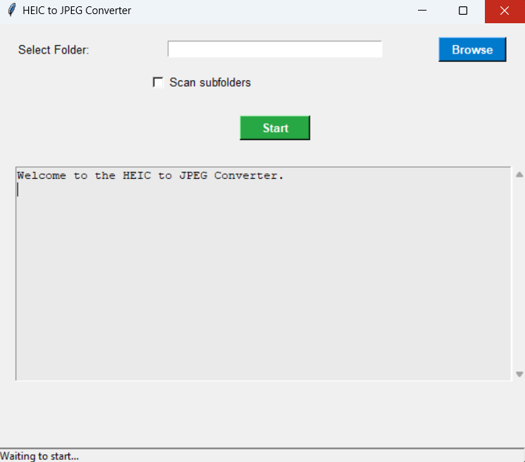

# HEIC to JPEG Converter

### Description

This Python application provides a simple graphical user interface (GUI) to convert **HEIC** image files into **JPEG** format. The app supports selecting a folder containing HEIC files, with an option to scan subfolders, and then converting all the images in one go. After the conversion, the original HEIC files are moved to the recycle bin.

This tool was created using **Tkinter** for the GUI, **Pillow** for handling images, and **pillow-heif** for HEIC support.



### Features

- **Folder Selection**: Select a folder containing your HEIC files.
- **Subfolder Scanning**: Optionally scan and convert files in subfolders.
- **Logging**: Get real-time feedback on which files are being converted and moved to the recycle bin.
- **Automatic Clean-up**: After conversion, HEIC files are moved to the recycle bin.
- **Multithreading**: Keeps the UI responsive while conversion is running in the background.

### Getting Started

#### Requirements

Make sure you have Python 3.x installed on your machine.

Install the required Python packages by running:

```bash
pip install -r requirements.txt
```

#### Installation

1. **Clone the Repository**:
   ```bash
   git clone https://github.com/yourusername/heic-to-jpeg-converter.git
   cd heic-to-jpeg-converter
   ```

2. **Install Dependencies**:
   Install the required Python libraries by running:
   ```bash
   pip install -r requirements.txt
   ```

#### Running the Application

To run the application, simply execute the following command in your terminal:

```bash
python heic_to_jpeg_converter.py
```

This will launch the graphical interface where you can select folders and start converting HEIC files to JPEG.

#### Usage

1. **Select a folder** containing the HEIC files you want to convert.
2. **Check the "Scan subfolders" box** if you want the program to look for HEIC files inside subfolders.
3. Click **Start** to begin the conversion process. The progress and status will be shown in the log window.

### Dependencies

- **Tkinter**: For building the GUI.
- **Pillow**: For handling image conversion.
- **pillow-heif**: For HEIC image support.
- **send2trash**: For moving old HEIC files to the recycle bin.
- **threading**: For ensuring a responsive UI during the conversion.

### License

This project is licensed under the MIT License - see the [LICENSE](LICENSE) file for details.

---

Feel free to contribute or raise any issues you encounter. Happy converting!
